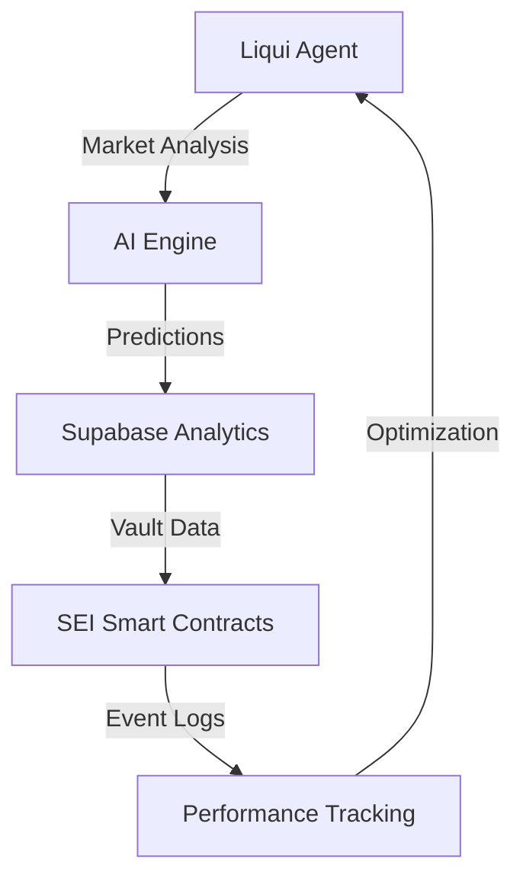

# SEI DLP Liqui Agent

AI-driven liquidity optimization agent for SEI Dynamic Liquidity Protocol (DLP) vaults.

## Features

- SEI EVM optimization with 400ms finality support (Chain ID: 713715)
- AI-driven vault rebalancing following StrategyVault.sol patterns
- Concentrated liquidity optimization using liquidity_ai.py models
- Cross-protocol yield aggregation and impermanent loss hedging
- Supabase integration for historical performance analytics
- Real-time vault monitoring and optimization recommendations
- Gas-efficient rebalancing (~$0.15 vs $50+ on other chains)

## Getting Started

```bash
# Install dependencies
bun install

# Set up environment variables
cp .env.example .env
# Edit .env with your Supabase and SEI network configuration

# Build the project
bun run build

# Start Liqui agent
elizaos start --port 3000

# Or start in development mode
elizaos dev
```

### Environment Configuration

```bash
# Supabase Configuration
SUPABASE_URL=https://your-project.supabase.co
SUPABASE_ANON_KEY=your_anon_key
SUPABASE_SERVICE_ROLE_KEY=your_service_role_key

# SEI Network Configuration
SEI_CHAIN_ID=713715
SEI_RPC_URL=https://evm-rpc.sei-apis.com

# AI Provider Keys
ANTHROPIC_API_KEY=your_anthropic_key
GOOGLE_GENERATIVE_AI_API_KEY=your_google_key
```

## Usage

### Vault Analysis

```
Hey Liqui, analyze my SEI-USDC vault at 0x123...
```

Liqui will provide:
- Current position analysis with tick ranges
- Fee capture efficiency metrics
- Impermanent loss risk assessment
- AI-driven optimization recommendations
- Gas cost estimates for rebalancing

### SEI Network Advantages

- **400ms Finality**: Instant position adjustments vs 12s on Ethereum
- **Low Gas Costs**: ~$0.15 per rebalance vs $50+ on other chains
- **Parallel Execution**: SEI-optimized transaction processing
- **Chain ID 713715**: Native SEI EVM support

## Testing

```bash
# Run all tests
bun test

# Run specific test suites
bun test src/__tests__/env.test.ts
bun test src/__tests__/e2e/

# Build and test
bun run build
elizaos test
```

## Architecture

Following the SEI DLP cross-component flow:



### Components

- **Liqui Character**: AI agent optimized for SEI DLP vault management
- **SEI DLP Plugin**: Custom actions for vault analysis and optimization
- **Supabase Integration**: Historical performance and prediction storage
- **StrategyVault.sol**: Smart contract integration following your patterns
- **liquidity_ai.py**: ML models for range prediction and optimization

## Configuration

Customize your SEI DLP Liqui agent by modifying:

- `src/index.ts` - Main entry point and project agent configuration
- `src/character.ts` - Liqui character definition with SEI-specific knowledge
- `src/plugin.ts` - SEI DLP plugin with vault optimization actions
- `.env` - Environment variables for Supabase and SEI network access

### SEI Network Integration

The agent is optimized for SEI EVM with:
- Chain ID validation (713715)
- 400ms finality optimization
- Gas-efficient transaction patterns
- Parallel execution support

### Vault Optimization Features

- Real-time position analysis
- AI-driven range predictions
- Impermanent loss monitoring
- Cross-protocol yield tracking
- Historical performance analytics

## Contributing

1. Fork the repository
2. Create a feature branch
3. Make your changes following SEI DLP patterns
4. Run tests: `bun test`
5. Submit a pull request

## License

MIT License - see LICENSE file for details.
you 