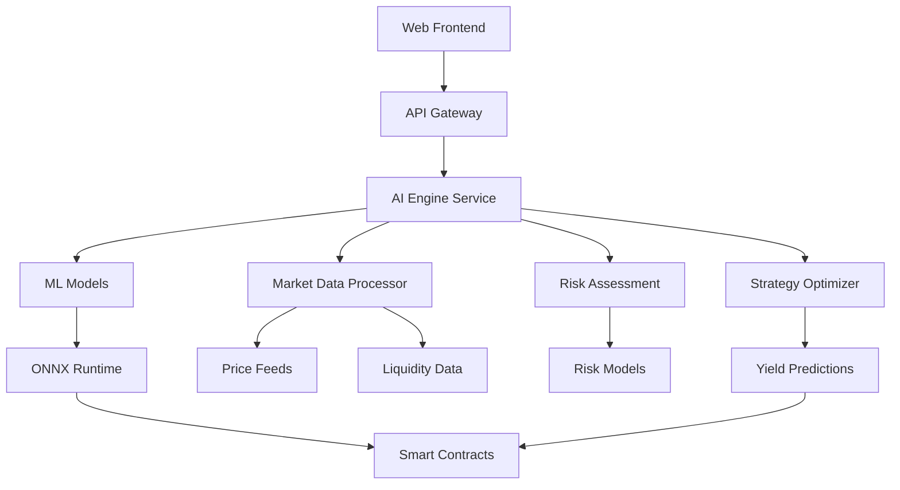

# AI Engine

Yield Delta's AI Engine powers intelligent yield optimization through machine learning models, real-time market analysis, and automated decision-making on the SEI Network.

## Architecture Overview

### Core Components



### Technology Stack

- **Framework**: Python FastAPI
- **ML Runtime**: ONNX Runtime
- **Models**: Custom neural networks + XGBoost
- **Data Processing**: Pandas, NumPy
- **Real-time**: WebSocket connections
- **Deployment**: Docker containers

## Machine Learning Models

### Yield Prediction Model

**Architecture**: Deep Neural Network
**Purpose**: Predict optimal APY for given market conditions

```python
# Model architecture
class YieldPredictorModel(nn.Module):
    def __init__(self, input_size=24, hidden_size=128):
        super().__init__()
        self.layers = nn.Sequential(
            nn.Linear(input_size, hidden_size),
            nn.ReLU(),
            nn.Dropout(0.2),
            nn.Linear(hidden_size, hidden_size // 2),
            nn.ReLU(),
            nn.Dropout(0.2),
            nn.Linear(hidden_size // 2, 1),
            nn.Sigmoid()
        )
    
    def forward(self, x):
        return self.layers(x) * 100  # Scale to percentage
```

**Input Features**:
- Token prices (SEI, USDC, ATOM, etc.)
- Trading volume (24h, 7d averages)
- Liquidity metrics (TVL, utilization rates)
- Market volatility indicators
- Historical APY data
- External market signals (BTC, ETH correlation)

**Output**: Predicted APY with confidence interval

### Risk Assessment Model

**Architecture**: Ensemble (XGBoost + Neural Network)
**Purpose**: Evaluate impermanent loss and market risks

```python
# Risk scoring function
def calculate_risk_score(
    volatility: float,
    liquidity_depth: float,
    correlation: float,
    historical_drawdown: float
) -> RiskAssessment:
    
    # Weighted risk components
    volatility_risk = min(volatility * 2.5, 100)
    liquidity_risk = max(0, 100 - liquidity_depth * 10)
    correlation_risk = abs(correlation - 0.5) * 200
    
    total_risk = (
        volatility_risk * 0.4 +
        liquidity_risk * 0.3 +
        correlation_risk * 0.2 +
        historical_drawdown * 0.1
    )
    
    return RiskAssessment(
        score=min(total_risk, 100),
        level=get_risk_level(total_risk),
        factors={
            'volatility': volatility_risk,
            'liquidity': liquidity_risk,
            'correlation': correlation_risk
        }
    )
```

### Position Optimization Model

**Architecture**: Reinforcement Learning (PPO)
**Purpose**: Determine optimal liquidity ranges and rebalancing frequency

```python
# RL environment for position optimization
class LiquidityEnvironment(gym.Env):
    def __init__(self, market_data):
        self.action_space = gym.spaces.Box(
            low=np.array([-50, -50, 0]),  # [tick_lower, tick_upper, rebalance_flag]
            high=np.array([50, 50, 1]),
            dtype=np.float32
        )
        self.observation_space = gym.spaces.Box(
            low=-np.inf, high=np.inf, shape=(16,), dtype=np.float32
        )
    
    def step(self, action):
        # Execute action and calculate reward
        tick_lower, tick_upper, rebalance = action
        
        # Calculate fees, impermanent loss, and yield
        reward = self.calculate_reward(tick_lower, tick_upper, rebalance)
        
        return self.get_observation(), reward, done, info
    
    def calculate_reward(self, tick_lower, tick_upper, rebalance):
        # Reward = yield - fees - impermanent_loss - gas_costs
        yield_earned = self.calculate_yield(tick_lower, tick_upper)
        fees_paid = self.calculate_fees() if rebalance else 0
        il_cost = self.calculate_impermanent_loss(tick_lower, tick_upper)
        gas_cost = 0.002 if rebalance else 0  # SEI gas cost
        
        return yield_earned - fees_paid - il_cost - gas_cost
```

## Real-time Market Analysis

### Data Sources

**Primary Sources**:
- SEI DEX aggregated feeds
- CoinGecko API for external prices
- Defillama for TVL data
- On-chain transaction analysis

**Update Frequency**:
- Price data: Every 5 seconds
- Liquidity data: Every 30 seconds
- Volume metrics: Every minute
- Model predictions: Every 5 minutes

### Market Signal Processing

```python
# Real-time signal processor
class MarketSignalProcessor:
    def __init__(self):
        self.price_buffer = deque(maxlen=1000)
        self.volume_buffer = deque(maxlen=1000)
        self.volatility_window = 20
    
    def process_new_data(self, price: float, volume: float):
        self.price_buffer.append(price)
        self.volume_buffer.append(volume)
        
        signals = {
            'price_trend': self.calculate_trend(),
            'volatility': self.calculate_volatility(),
            'volume_profile': self.analyze_volume(),
            'momentum': self.calculate_momentum(),
            'support_resistance': self.find_levels()
        }
        
        return self.generate_trading_signals(signals)
    
    def calculate_volatility(self) -> float:
        if len(self.price_buffer) < self.volatility_window:
            return 0.0
        
        returns = np.diff(np.log(list(self.price_buffer)[-self.volatility_window:]))
        return np.std(returns) * np.sqrt(365 * 24 * 60)  # Annualized volatility
```

### Prediction Pipeline

```python
# End-to-end prediction pipeline
async def generate_yield_prediction(
    token_pair: str,
    strategy: str,
    amount: float,
    timeframe: str = "7d"
) -> YieldPrediction:
    
    # 1. Gather market data
    market_data = await fetch_market_data(token_pair)
    
    # 2. Preprocess features
    features = preprocess_features(market_data, strategy, amount)
    
    # 3. Run ML model
    prediction = yield_model.predict(features)
    confidence = calculate_confidence(features, prediction)
    
    # 4. Risk assessment
    risk = risk_model.assess_risk(market_data, prediction)
    
    # 5. Generate optimal range
    optimal_range = position_optimizer.optimize(
        market_data, prediction, risk.level
    )
    
    return YieldPrediction(
        expected_apy=prediction[0],
        confidence=confidence,
        risk_assessment=risk,
        optimal_range=optimal_range,
        timestamp=datetime.utcnow()
    )
```

## API Endpoints

### Prediction API

```python
# FastAPI endpoint for yield predictions
@app.post("/ai/predict")
async def predict_yield(request: PredictionRequest) -> PredictionResponse:
    """Generate AI-powered yield predictions"""
    
    try:
        # Validate input
        validate_prediction_request(request)
        
        # Generate prediction
        prediction = await generate_yield_prediction(
            token_pair=request.symbol,
            strategy=request.strategy,
            amount=request.amount,
            timeframe=request.timeframe
        )
        
        return PredictionResponse(
            success=True,
            data=prediction,
            model_version="1.2.3",
            processing_time_ms=time.time() - start_time
        )
        
    except Exception as e:
        logger.error(f"Prediction failed: {str(e)}")
        return PredictionResponse(
            success=False,
            error=str(e),
            error_code="PREDICTION_FAILED"
        )
```

### Rebalancing API

```python
@app.post("/ai/rebalance")
async def generate_rebalance_recommendations(
    request: RebalanceRequest
) -> RebalanceResponse:
    """Generate AI-powered rebalancing recommendations"""
    
    # Analyze current position
    position = await get_vault_position(request.vault_address)
    market_data = await fetch_market_data(position.token_pair)
    
    # Generate recommendations
    recommendations = []
    
    # Check if position is out of range
    if position.current_price < position.tick_lower or position.current_price > position.tick_upper:
        new_range = position_optimizer.optimize_range(market_data)
        recommendations.append({
            "action": "rebalance",
            "priority": "high",
            "reason": "Position out of range",
            "new_range": new_range,
            "estimated_gas": "0.002 SEI"
        })
    
    # Check for better yield opportunities
    better_strategies = await find_better_strategies(position)
    for strategy in better_strategies:
        recommendations.append({
            "action": "migrate",
            "priority": "medium",
            "from_vault": position.vault_address,
            "to_vault": strategy.vault_address,
            "yield_improvement": strategy.apy_difference,
            "estimated_gas": "0.004 SEI"
        })
    
    return RebalanceResponse(
        success=True,
        recommendations=recommendations,
        total_actions=len(recommendations),
        estimated_total_gas=sum(r.get("estimated_gas", 0) for r in recommendations)
    )
```

## Model Training

### Data Collection

```python
# Historical data collection for model training
class DataCollector:
    def __init__(self):
        self.sources = [
            SeiDexDataSource(),
            CoinGeckoDataSource(),
            DefillamaDataSource(),
            OnChainDataSource()
        ]
    
    async def collect_training_data(
        self, 
        start_date: datetime, 
        end_date: datetime
    ) -> pd.DataFrame:
        
        data_frames = []
        
        for source in self.sources:
            try:
                data = await source.fetch_historical_data(start_date, end_date)
                data_frames.append(data)
            except Exception as e:
                logger.warning(f"Failed to collect from {source.name}: {e}")
        
        # Merge all data sources
        combined_data = pd.concat(data_frames, axis=1)
        
        # Fill missing values and clean data
        cleaned_data = self.clean_data(combined_data)
        
        return cleaned_data
```

### Model Training Pipeline

```python
# Automated model training pipeline
class ModelTrainingPipeline:
    def __init__(self):
        self.mlflow_client = mlflow.tracking.MlflowClient()
        
    def train_yield_prediction_model(self, data: pd.DataFrame):
        # Split data
        X_train, X_test, y_train, y_test = train_test_split(
            data.drop('apy', axis=1), 
            data['apy'], 
            test_size=0.2, 
            random_state=42
        )
        
        # Feature scaling
        scaler = StandardScaler()
        X_train_scaled = scaler.fit_transform(X_train)
        X_test_scaled = scaler.transform(X_test)
        
        # Train model
        model = YieldPredictorModel()
        optimizer = torch.optim.Adam(model.parameters(), lr=0.001)
        criterion = nn.MSELoss()
        
        for epoch in range(100):
            model.train()
            optimizer.zero_grad()
            
            outputs = model(torch.FloatTensor(X_train_scaled))
            loss = criterion(outputs.squeeze(), torch.FloatTensor(y_train.values))
            
            loss.backward()
            optimizer.step()
            
            if epoch % 10 == 0:
                print(f'Epoch {epoch}, Loss: {loss.item():.4f}')
        
        # Evaluate model
        model.eval()
        with torch.no_grad():
            predictions = model(torch.FloatTensor(X_test_scaled))
            mse = mean_squared_error(y_test, predictions.numpy())
            r2 = r2_score(y_test, predictions.numpy())
            
        print(f'Test MSE: {mse:.4f}, R²: {r2:.4f}')
        
        # Convert to ONNX for deployment
        self.export_to_onnx(model, X_train_scaled.shape[1])
        
        return model, scaler
    
    def export_to_onnx(self, model, input_size):
        dummy_input = torch.randn(1, input_size)
        torch.onnx.export(
            model,
            dummy_input,
            "models/yield_predictor.onnx",
            export_params=True,
            opset_version=11,
            input_names=['features'],
            output_names=['prediction']
        )
```

## Performance Monitoring

### Model Performance Metrics

```python
# Real-time model monitoring
class ModelMonitor:
    def __init__(self):
        self.prediction_buffer = deque(maxlen=1000)
        self.actual_buffer = deque(maxlen=1000)
        
    def log_prediction(self, prediction: float, actual: float = None):
        self.prediction_buffer.append(prediction)
        if actual is not None:
            self.actual_buffer.append(actual)
            
    def calculate_metrics(self) -> Dict[str, float]:
        if len(self.actual_buffer) < 10:
            return {}
            
        predictions = np.array(list(self.prediction_buffer)[-len(self.actual_buffer):])
        actuals = np.array(list(self.actual_buffer))
        
        return {
            'mae': mean_absolute_error(actuals, predictions),
            'mse': mean_squared_error(actuals, predictions),
            'r2': r2_score(actuals, predictions),
            'mape': np.mean(np.abs((actuals - predictions) / actuals)) * 100
        }
    
    def detect_drift(self) -> bool:
        metrics = self.calculate_metrics()
        
        # Trigger retraining if performance degrades
        return (
            metrics.get('mape', 0) > 15 or  # More than 15% error
            metrics.get('r2', 1) < 0.7      # Less than 70% explained variance
        )
```

## Integration with Smart Contracts

### Oracle Integration

```python
# Smart contract oracle integration
class AIOracle:
    def __init__(self, contract_address: str, private_key: str):
        self.w3 = Web3(Web3.HTTPProvider(SEI_RPC_URL))
        self.contract = self.w3.eth.contract(
            address=contract_address,
            abi=AI_ORACLE_ABI
        )
        self.account = self.w3.eth.account.from_key(private_key)
    
    async def update_prediction(
        self, 
        vault_address: str, 
        prediction: YieldPrediction
    ):
        # Create signed prediction data
        prediction_data = {
            'vault': vault_address,
            'expectedAPY': int(prediction.expected_apy * 100),  # Basis points
            'confidence': int(prediction.confidence * 100),
            'lowerTick': prediction.optimal_range.lower_tick,
            'upperTick': prediction.optimal_range.upper_tick,
            'timestamp': int(prediction.timestamp.timestamp())
        }
        
        # Sign the prediction
        message_hash = self.w3.keccak(encode_abi_packed(
            ['address', 'uint256', 'uint256', 'int256', 'int256', 'uint256'],
            [
                vault_address,
                prediction_data['expectedAPY'],
                prediction_data['confidence'],
                prediction_data['lowerTick'],
                prediction_data['upperTick'],
                prediction_data['timestamp']
            ]
        ))
        
        signature = self.account.sign_message(message_hash)
        
        # Submit to smart contract
        tx = self.contract.functions.updatePrediction(
            vault_address,
            prediction_data,
            signature.signature
        ).build_transaction({
            'from': self.account.address,
            'gas': 100000,
            'gasPrice': self.w3.to_wei('1', 'gwei'),
            'nonce': self.w3.eth.get_transaction_count(self.account.address)
        })
        
        signed_tx = self.account.sign_transaction(tx)
        tx_hash = self.w3.eth.send_raw_transaction(signed_tx.rawTransaction)
        
        return tx_hash.hex()
```

## Deployment

### Docker Configuration

```dockerfile
# AI Engine Dockerfile
FROM python:3.11-slim

WORKDIR /app

# Install system dependencies
RUN apt-get update && apt-get install -y \
    gcc \
    g++ \
    && rm -rf /var/lib/apt/lists/*

# Install Python dependencies
COPY requirements.txt .
RUN pip install --no-cache-dir -r requirements.txt

# Copy application code
COPY src/ ./src/
COPY models/ ./models/

# Expose port
EXPOSE 8000

# Health check
HEALTHCHECK --interval=30s --timeout=10s --start-period=5s --retries=3 \
    CMD curl -f http://localhost:8000/health || exit 1

# Run application
CMD ["python", "-m", "uvicorn", "src.main:app", "--host", "0.0.0.0", "--port", "8000"]
```

### Production Deployment

```yaml
# Kubernetes deployment
apiVersion: apps/v1
kind: Deployment
metadata:
  name: ai-engine
spec:
  replicas: 3
  selector:
    matchLabels:
      app: ai-engine
  template:
    metadata:
      labels:
        app: ai-engine
    spec:
      containers:
      - name: ai-engine
        image: yielddelta/ai-engine:latest
        ports:
        - containerPort: 8000
        env:
        - name: MODEL_PATH
          value: "/app/models"
        - name: REDIS_URL
          value: "redis://redis-service:6379"
        resources:
          requests:
            memory: "2Gi"
            cpu: "1000m"
          limits:
            memory: "4Gi"
            cpu: "2000m"
        livenessProbe:
          httpGet:
            path: /health
            port: 8000
          initialDelaySeconds: 30
          periodSeconds: 10
```

## Troubleshooting

### Common Issues

**Model Loading Failures**
```bash
# Check ONNX model format
python -c "import onnx; model = onnx.load('models/yield_predictor.onnx'); onnx.checker.check_model(model)"

# Verify model inputs
python -c "import onnxruntime as ort; session = ort.InferenceSession('models/yield_predictor.onnx'); print(session.get_inputs())"
```

**Performance Issues**
```bash
# Monitor GPU usage
nvidia-smi

# Check memory usage
ps aux | grep python

# Profile code
python -m cProfile -o profile.out src/main.py
```

**API Errors**
```bash
# Check logs
docker logs ai-engine-container

# Test endpoint
curl -X POST http://localhost:8000/ai/predict \
  -H "Content-Type: application/json" \
  -d '{"symbol": "SEI-USDC", "strategy": "concentrated_liquidity", "amount": 1000}'
```

---

*The AI Engine is the brain of Yield Delta, continuously learning and optimizing for maximum yield.*