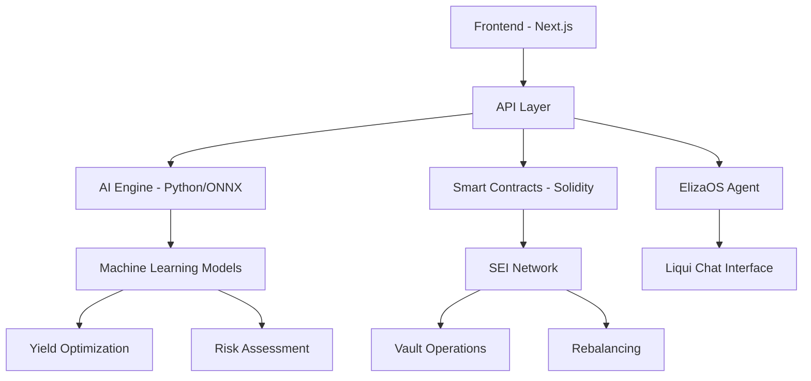

# Yield Delta Documentation

Welcome to the comprehensive documentation for **Yield Delta** - the next-generation AI-powered DeFi platform built on SEI Network.

## 🌊 What is Yield Delta?

Yield Delta is an **AI-powered yield optimization platform** that combines cutting-edge machine learning with the lightning-fast SEI blockchain to maximize your DeFi yields while minimizing risk.

### Key Innovations

- 🧠 **AI-Powered Optimization** - Machine learning algorithms continuously optimize liquidity positions
- ⚡ **SEI Network Speed** - Leverage 400ms block finality for rapid rebalancing 
- 🛡️ **Impermanent Loss Protection** - Advanced hedging strategies minimize IL risk
- 📊 **Real-time Analytics** - Beautiful 3D visualizations powered by Three.js and GSAP

## 🚀 Quick Start

Choose your path to get started:

<div className="grid grid-cols-1 md:grid-cols-2 gap-6 mt-6">
  <div className="border rounded-lg p-6 hover:shadow-lg transition-shadow">
    <h3 className="text-lg font-semibold mb-2">🏗️ For Developers</h3>
    <p className="text-gray-600 mb-4">Build on top of Yield Delta, integrate our APIs, or contribute to the protocol.</p>
    <a href="/docs/getting-started" className="text-blue-600 hover:text-blue-800 font-medium">
      Development Guide →
    </a>
  </div>
  
  <div className="border rounded-lg p-6 hover:shadow-lg transition-shadow">
    <h3 className="text-lg font-semibold mb-2">💰 For Liquidity Providers</h3>
    <p className="text-gray-600 mb-4">Learn how to provide liquidity and maximize your yields with AI optimization.</p>
    <a href="/docs/features/liquidity-provision" className="text-blue-600 hover:text-blue-800 font-medium">
      User Guide →
    </a>
  </div>
</div>

## 📋 Core Features

| Feature | Description | Status |
|---------|-------------|--------|
| [AI-Powered Rebalancing](/docs/features/ai-rebalancing) | Automated position optimization using ML | ✅ Live |
| [Vault Management](/docs/features/vaults) | ERC-4626 compatible yield vaults | ✅ Live |
| [Liqui Chat](/docs/features/ai-chat) | AI assistant for DeFi strategy | ✅ Live |
| [Market Analytics](/docs/features/market-data) | Real-time market data and insights | ✅ Live |
| [Demo Mode](/docs/demo-mode) | Risk-free testing environment | ✅ Live |

## 🏗️ Architecture Overview



## 🌐 Network Information

- **Chain ID**: 713715 (SEI Devnet) / 1328 (SEI Mainnet)
- **Native Token**: SEI
- **Block Time**: ~400ms
- **Explorer**: [SeiTrace](https://seitrace.com)

## 🎭 Demo Mode

Experience SEI DLP Core risk-free with our demo mode:

```bash
# Enable demo mode
echo "NEXT_PUBLIC_DEMO_MODE=true" >> .env.local

# Start the application
bun dev
```

Demo mode simulates all transactions without touching the blockchain, perfect for:
- Testing strategies
- Recording demonstrations
- Training users
- Development

## 📚 Documentation Sections

### Getting Started
- [Installation & Setup](/docs/getting-started)
- [Environment Configuration](/docs/getting-started/environment)
- [First Vault Deployment](/docs/getting-started/first-vault)

### Core Features
- [Vault Management](/docs/features/vaults)
- [AI-Powered Rebalancing](/docs/features/ai-rebalancing)
- [Liqui Chat Assistant](/docs/features/ai-chat)
- [Market Data & Analytics](/docs/features/market-data)

### API Reference
- [REST API Documentation](/docs/api)
- [WebSocket Events](/docs/api/websockets)
- [Rate Limits & Authentication](/docs/api/authentication)

### Smart Contracts
- [Contract Architecture](/docs/smart-contracts)
- [Deployment Guide](/docs/smart-contracts/deployment)
- [Security Audits](/docs/smart-contracts/security)

### AI Engine
- [Model Architecture](/docs/ai-engine)
- [Training Data](/docs/ai-engine/training)
- [API Integration](/docs/ai-engine/api)

## 🤝 Community & Support

- **Discord**: [Join our community](https://discord.gg/sei)
- **GitHub**: [Contribute to the project](https://github.com/your-org/sei-dlp-core)
- **Twitter**: [@SEI_DLP](https://twitter.com/sei_dlp)

## 📄 License

Yield Delta is open-source software licensed under the [MIT License](https://opensource.org/licenses/MIT).

---

*Built with ❤️ by Yield Delta on SEI Network*