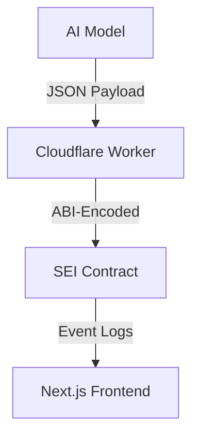

# SEI DLP Copilot Instructions

## 🧠 Project Context
**Core Objective**: Build AI-driven dynamic liquidity vaults on SEI EVM combining:
- Concentrated liquidity optimization
- Cross-protocol yield aggregation
- Impermanent loss hedging

**Key Tech**: 
- SEI EVM (400ms finality)
- Next.js 14 App Router
- Python AI/ML models
- Solidity 0.8.20+

## 🛠️ Coding Patterns

### Smart Contracts
```solidity
// StrategyVault.sol conventions
contract StrategyVault {
    // Use SEI-specific gas optimizations
    function _updatePosition() internal {
        // Always include SEI chain ID check
        if (block.chainid != 713715) revert InvalidChain();
    }
}
```

### Frontend

```tsx
// VaultCard.tsx standards
export function VaultCard({ vault }: { vault: SEIVault }) {
    // Use SEI-native hooks
    const { data } = useReadContract({
        chainId: 713715,
        abi: vaultABI,
        address: vault.address
    });
}
```

### AI Engine

```python
# ai_engine.py standards
def get_vault_data(vault_address: str) -> dict:
    # Use SEI-specific APIs
    response = sei_api.get(f"/vaults/{vault_address}")
    return response.json()
```
#### liquidity_ai.py patterns
```python
def predict_range(price_data: pd.DataFrame) -> tuple[float, float]:
    """SEI-specific volatility scaling"""
    return (current_price * 0.98, current_price * 1.02)
```

### Cross-Component Flow
