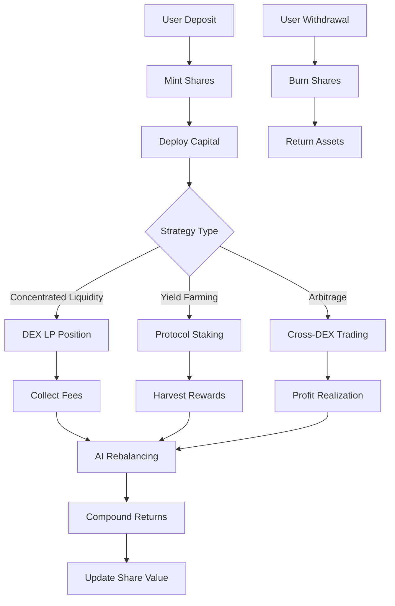

# Vault Management

Yield Delta's vault system provides secure, gas-optimized yield generation using ERC-4626 compatible smart contracts with advanced AI optimization.

## Overview

Our vault architecture combines traditional DeFi vault functionality with cutting-edge AI-powered optimization specifically designed for the SEI Network's high-speed environment.

### Key Features

- **ERC-4626 Compatibility**: Standard vault interface for maximum interoperability
- **AI-Driven Optimization**: Machine learning algorithms continuously optimize positions
- **Gas Efficiency**: Optimized for SEI's 400ms block finality
- **Multiple Strategies**: Support for various yield generation approaches
- **Auto-Compounding**: Automatic reinvestment of rewards

## Vault Types

### Concentrated Liquidity Vaults

**Strategy**: Automated concentrated liquidity provision on DEXs

```typescript
interface ConcentratedLiquidityVault {
  tokenA: Token;
  tokenB: Token;
  fee: number;        // Pool fee tier (0.01%, 0.05%, 0.3%, 1%)
  tickSpacing: number; // Price range granularity
  strategy: {
    rebalanceFrequency: number; // Rebalance every N blocks
    riskTolerance: 'low' | 'medium' | 'high';
    maxSlippage: number;        // Maximum allowed slippage
  };
}
```

**Benefits**:
- Higher capital efficiency than traditional LP
- AI-optimized tick ranges for maximum fees
- Automatic rebalancing to maintain optimal positions
- Impermanent loss protection through hedging

**Target APY**: 15-45% depending on pair and market conditions

### Yield Farming Vaults

**Strategy**: Automated yield farming across multiple protocols

```typescript
interface YieldFarmingVault {
  protocols: Protocol[];      // Supported farming protocols
  assets: Token[];           // Supported deposit tokens
  strategy: {
    allocation: Record<string, number>; // Protocol allocation %
    harvestFrequency: number;          // Auto-harvest timing
    compoundingRatio: number;          // % of rewards to compound
  };
}
```

**Benefits**:
- Diversified risk across multiple protocols
- Automated harvesting and compounding
- Gas-efficient batch operations
- AI-driven allocation optimization

**Target APY**: 8-25% with lower volatility

### Arbitrage Vaults

**Strategy**: Automated arbitrage opportunities across SEI ecosystem

```typescript
interface ArbitrageVault {
  exchanges: DEX[];          // Monitored DEXs
  tokens: Token[];          // Arbitrage token pairs
  strategy: {
    minProfitThreshold: number;    // Minimum profit to execute
    maxPositionSize: number;       // Risk management
    executionSpeed: 'fast' | 'optimal'; // Speed vs profit optimization
  };
}
```

**Benefits**:
- Market-neutral strategy
- Profit from price inefficiencies
- Low correlation with market movements
- High-frequency AI execution

**Target APY**: 12-30% with consistent returns

## Vault Architecture

### Smart Contract Structure

```solidity
contract YieldDeltaVault is ERC4626, Ownable, ReentrancyGuard {
    // Core vault state
    IERC20 public immutable asset;
    string public strategy;
    uint256 public totalAssets;
    uint256 public totalSupply;
    
    // Fee structure
    uint256 public managementFee = 200;    // 2% annual
    uint256 public performanceFee = 1000;  // 10% of profits
    uint256 public constant MAX_FEE = 2000; // 20% maximum
    
    // AI integration
    address public aiOracle;
    uint256 public lastRebalance;
    uint256 public rebalanceInterval = 3600; // 1 hour minimum
    
    // Position tracking
    struct Position {
        uint128 liquidity;
        int24 tickLower;
        int24 tickUpper;
        uint256 fees0;
        uint256 fees1;
    }
    
    mapping(address => Position) public positions;
    
    // Core ERC4626 functions
    function deposit(uint256 assets, address receiver) 
        external override nonReentrant returns (uint256 shares);
        
    function withdraw(uint256 assets, address receiver, address owner)
        external override nonReentrant returns (uint256 shares);
        
    function redeem(uint256 shares, address receiver, address owner)
        external override nonReentrant returns (uint256 assets);
    
    // AI-powered functions
    function aiRebalance(RebalanceParams calldata params) 
        external onlyAIOracle;
        
    function updateStrategy(StrategyParams calldata params)
        external onlyOwner;
}
```

### Asset Flow Diagram



## User Interface

### Vault Dashboard

The vault interface provides comprehensive information and controls:

```typescript
interface VaultDashboard {
  overview: {
    totalDeposited: number;
    currentValue: number;
    unrealizedPnL: number;
    realizedPnL: number;
    shares: number;
    apy: {
      current: number;
      average7d: number;
      average30d: number;
    };
  };
  
  performance: {
    timeline: PerformanceDataPoint[];
    benchmark: BenchmarkComparison;
    fees: FeeBreakdown;
    transactions: Transaction[];
  };
  
  actions: {
    deposit: (amount: number) => Promise<TransactionResult>;
    withdraw: (amount: number) => Promise<TransactionResult>;
    rebalance: () => Promise<TransactionResult>;
  };
}
```

### Deposit Flow

1. **Select Vault**: Choose from available vault strategies
2. **Enter Amount**: Specify deposit amount with balance validation
3. **Review Terms**: Confirm fees, risks, and expected returns
4. **Execute Transaction**: Submit to blockchain with gas estimation
5. **Confirmation**: Receive transaction hash and updated position

```typescript
// Example deposit flow
const handleDeposit = async (amount: number) => {
  try {
    // Validate input
    validateDepositAmount(amount, userBalance);
    
    // Estimate gas and fees
    const gasEstimate = await estimateDepositGas(vaultAddress, amount);
    const fees = calculateFees(amount, vault.managementFee);
    
    // Show confirmation modal
    const confirmed = await showConfirmationModal({
      amount,
      gasEstimate,
      fees,
      expectedShares: calculateShares(amount, vault.sharePrice)
    });
    
    if (!confirmed) return;
    
    // Execute deposit
    const tx = await vaultContract.deposit(
      parseUnits(amount.toString(), token.decimals),
      userAddress
    );
    
    // Wait for confirmation
    const receipt = await tx.wait();
    
    // Update UI
    updateVaultPosition();
    showSuccessMessage(receipt.transactionHash);
    
  } catch (error) {
    handleTransactionError(error);
  }
};
```

## Risk Management

### Automated Risk Controls

```typescript
interface RiskManagement {
  maxDrawdown: number;        // Maximum acceptable loss
  stopLoss: number;          // Automatic exit threshold
  positionLimits: {
    maxSinglePosition: number;   // Per-position size limit
    maxTotalExposure: number;    // Total exposure limit
    diversificationMin: number;  // Minimum diversification
  };
  
  monitoring: {
    realTimeRisk: boolean;
    alertThresholds: AlertConfig;
    automaticActions: ActionConfig;
  };
}
```

### Risk Metrics

**Value at Risk (VaR)**:
- 1-day VaR at 95% confidence
- Maximum expected loss over 24 hours
- Updated every block

**Sharpe Ratio**:
- Risk-adjusted return measurement
- Calculated over rolling 30-day periods
- Compared against SEI staking baseline

**Maximum Drawdown**:
- Largest peak-to-trough decline
- Historical and rolling metrics
- Protection mechanisms activated at thresholds

### Impermanent Loss Protection

For concentrated liquidity vaults, we implement IL protection:

```typescript
class ImpermanentLossProtection {
  private hedgeRatio: number;
  private delta: number;
  
  async calculateHedge(position: Position): Promise<HedgePosition> {
    // Calculate delta exposure
    this.delta = this.calculateDelta(position);
    
    // Determine hedge requirement
    const hedgeAmount = this.delta * position.value * this.hedgeRatio;
    
    // Execute hedge if profitable
    if (hedgeAmount > this.minHedgeThreshold) {
      return this.executeHedge(hedgeAmount, position.tokenPair);
    }
    
    return null;
  }
  
  private calculateDelta(position: Position): number {
    // Calculate price sensitivity of position
    const priceImpact = this.simulatePriceChange(position, 0.01); // 1% change
    return priceImpact / 0.01;
  }
}
```

## Analytics & Reporting

### Performance Tracking

```typescript
interface VaultAnalytics {
  returns: {
    daily: number[];
    cumulative: number;
    benchmark: number;
    alpha: number;      // Excess return vs benchmark
    beta: number;       // Market correlation
  };
  
  risk: {
    volatility: number;
    sharpe: number;
    maxDrawdown: number;
    var95: number;
  };
  
  operations: {
    rebalanceCount: number;
    gasEfficiency: number;
    successRate: number;
    averageSlippage: number;
  };
}
```

### Fee Transparency

All fees are clearly displayed and tracked:

- **Management Fee**: 2% annually, charged continuously
- **Performance Fee**: 10% of profits above high water mark
- **Gas Costs**: Actual blockchain fees (typically 0.001-0.005 SEI)
- **Slippage**: Market impact of large trades

### Historical Performance

```typescript
// Example performance data structure
const performanceData = {
  "2024-01": {
    apy: 23.4,
    totalReturn: 1.95,
    gasUsed: 0.023,
    rebalances: 12,
    sharpe: 1.67
  },
  "2024-02": {
    apy: 28.1,
    totalReturn: 2.34,
    gasUsed: 0.019,
    rebalances: 15,
    sharpe: 1.89
  }
  // ... more historical data
};
```

## Advanced Features

### Flash Loan Integration

Vaults can utilize flash loans for gas-efficient rebalancing:

```solidity
function flashRebalance(
    address flashLoanProvider,
    uint256 amount,
    bytes calldata params
) external onlyAIOracle {
    // 1. Take flash loan
    IFlashLoanProvider(flashLoanProvider).flashLoan(
        amount,
        address(this),
        params
    );
}

function executeOperation(
    uint256 amount,
    uint256 fee,
    bytes calldata params
) external override {
    // 2. Execute complex rebalancing with borrowed funds
    RebalanceParams memory rebalanceParams = abi.decode(params, (RebalanceParams));
    
    // 3. Perform swaps, add/remove liquidity
    _executeRebalance(rebalanceParams);
    
    // 4. Repay flash loan + fee
    IERC20(asset).transfer(msg.sender, amount + fee);
}
```

### Cross-Chain Functionality

Future support for cross-chain vault operations:

```typescript
interface CrossChainVault {
  sourceChain: number;      // Origin chain ID
  targetChains: number[];   // Supported destination chains
  bridgeProtocol: string;   // Bridge provider
  
  bridgeAssets(
    amount: number,
    targetChain: number,
    strategy: string
  ): Promise<BridgeTransaction>;
}
```

### Governance Integration

Vault strategy updates through decentralized governance:

```solidity
contract VaultGovernance {
    struct Proposal {
        address vault;
        StrategyUpdate strategy;
        uint256 votes;
        uint256 deadline;
        bool executed;
    }
    
    mapping(uint256 => Proposal) public proposals;
    
    function proposeStrategyUpdate(
        address vault,
        StrategyUpdate calldata strategy
    ) external returns (uint256 proposalId);
    
    function vote(uint256 proposalId, bool support) external;
    
    function executeProposal(uint256 proposalId) external;
}
```

## Getting Started

### Quick Deposit

1. **Connect Wallet**: Ensure you have SEI for gas fees
2. **Choose Vault**: Select strategy based on risk preference
3. **Deposit Funds**: Minimum 1 SEI, maximum varies by vault
4. **Monitor Performance**: Track returns in real-time

### Best Practices

- **Start Small**: Begin with small deposits to understand the system
- **Diversify**: Use multiple vault strategies to reduce risk
- **Monitor Regularly**: Check performance and rebalance if needed
- **Understand Fees**: Factor in all costs when calculating returns

---

*Vault management combines the security of traditional DeFi with the intelligence of AI optimization.*